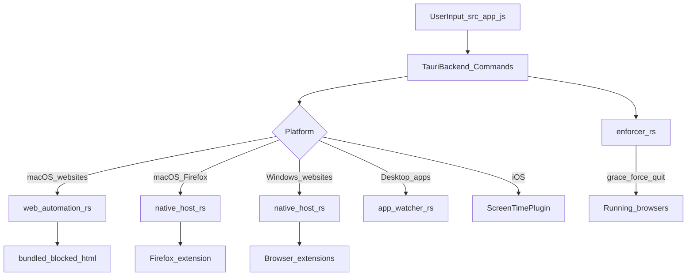
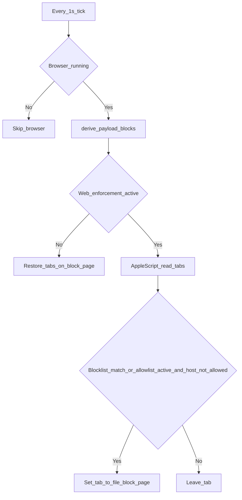
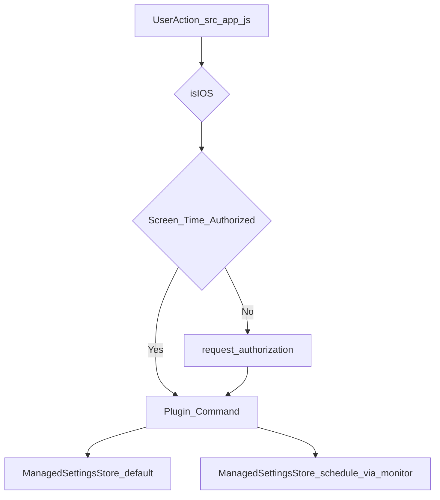
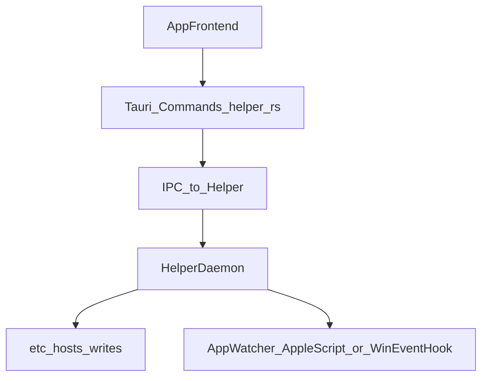
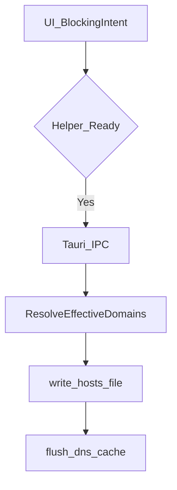

# Digital Habits: Blocker Architecture Reference (macOS, Windows, iOS)

Technical source-of-truth for how Digital Habits: Blocker works today and how earlier
versions worked. Implementation-aligned, with file references to actual
code paths.

## How this document is organized

| Section | What it covers |
|---|---|
| **[Part I — v3 (current)](#part-i--current-architecture-v3)** | Desktop runtime as shipped in v3.0+: macOS Automation blocking for Safari and Chromium browsers, extension blocking on Windows and macOS Firefox, in-process app blocking, compliance enforcer, iOS Screen Time. **Start here.** |
| **[Part II — v2 (historical)](#part-ii--v2-architecture-historical)** | v2.0–v2.4.x desktop design: every browser blocked via the Digital Habits: Focus extension (including Safari App Group bridge). Superseded on macOS by v3 Automation; Windows is still on this model. |
| **[Part III — v1 (historical)](#part-iii--v1-architecture-historical)** | v1.x privileged helper daemon, `/etc/hosts` writes, helper-owned enforcement state. Removed in v2; migration code still cleans residue on upgrade. |

### v3 desktop runtime in three lines

- **Website blocking (macOS):** Safari, Chrome, Brave, and Edge are driven by
  **Automation** (Apple Events) in `src-tauri/src/web_automation.rs` — blocked
  tabs redirect to a bundled block page (`src-tauri/blocked/`). **Firefox on
  macOS** still uses the **Digital Habits: Focus extension** + native-messaging host
  (`src-tauri/src/native_host.rs`). **Windows:** all supported browsers use
  the extension + native host (unchanged from v2).
- **Compliance enforcer** (`src-tauri/src/enforcer.rs`) — 5 s scan tick,
  user-configurable grace (5–300 s, default 60 s), force-quits non-compliant
  *running* browsers during active website blocks when the user has opted in.
  On macOS, Safari/Chromium compliance = Automation TCC; Firefox/Windows =
  extension profile scan (`src-tauri/src/profile_scan.rs`).
- **App blocking** runs in-process via `src-tauri/src/app_watcher.rs` (sysinfo
  poll-and-kill on both desktop OSes). **No privileged helper daemon. No
  hosts-file writes.** v1.x cleanup runs once via
  `src-tauri/src/commands/migration.rs`.

Deeper v2 migration notes live in
[browser-ext-migration/V2_OVERVIEW.md](browser-ext-migration/V2_OVERVIEW.md).

---

# Part I — Current architecture (v3)

## 1) Scope and goals

This section explains the **current** runtime:

- core architecture on desktop and iOS,
- state ownership and synchronization,
- website and app enforcement pipelines,
- lifecycle flows (start, schedule, override, uninstall, v1 migration),
- override difficulty and blocklist duplication,
- diagnostics surfaces,
- cross-platform differences.

### Primary code surfaces (v3)

| Area | Files |
|---|---|
| Frontend orchestration | `src/app.js` (entry: init sequence + event wiring), `src/index.html`, `src/styles.css` |
| Frontend shared state | `src/state.js` (mutable cross-module state object), `src/tauri-api.js` (Tauri command compat layer) |
| Frontend hubs | `src/persistence.js` (load/save/hosts sync), `src/render.js` (render cycle + tick loop), `src/schedule-engine.js` (occurrence math + helper sync) |
| Frontend features | `src/blocklists.js`, `src/confirm-modals.js`, `src/schedule-editor.js`, `src/schedule-overlay.js`, `src/enforcement.js`, `src/onboarding.js`, `src/blocking-platform.js`, `src/settings.js`, `src/update-banner.js`, `src/theme.js`, `src/override-challenge.js`, `src/time-inputs.js`, `src/website-input.js`, `src/apps-picker.js`, `src/modal-manager.js` |
| Frontend leaf utilities | `src/utils.js`, `src/i18n.js`, `src/blocklist-utils.js`, `src/dev-internals.js` (test surface: `window.__REDDBLOCK_INTERNALS__`) |

Frontend module conventions: mutable state shared across modules lives on the
`state` object in `src/state.js` (ES import bindings are read-only, so plain
`let`s cannot be reassigned across modules); module top level contains
declarations only — never calls into other app modules — which makes the
import cycles between hubs and features safe (all cross-module calls are
hoisted function declarations invoked at runtime). The order-sensitive
startup sequence lives in the `DOMContentLoaded` handler in `src/app.js`.
The `window.__REDDBLOCK_INTERNALS__` keys in `src/dev-internals.js` are a
contract with the in-app test scripts — never rename them.
| App data persistence | `src-tauri/src/commands/data.rs` |
| Legacy command names (shim) | `src-tauri/src/commands/helper_shim.rs` |
| macOS Automation blocking | `src-tauri/src/web_automation.rs`, `src-tauri/src/commands/web_automation.rs` |
| Windows + macOS Firefox extension host | `src-tauri/src/native_host.rs`, `src-tauri/src/native_host_install.rs` |
| Extension install hints | `src-tauri/src/extension_install.rs` |
| Browser profile / extension scan | `src-tauri/src/profile_scan.rs` |
| Compliance enforcer | `src-tauri/src/enforcer.rs`, `src-tauri/src/commands/enforcement_toggle.rs` |
| App blocking watcher | `src-tauri/src/app_watcher.rs`, `src-tauri/src/commands/app_blocking.rs` |
| v1.x migration / hosts cleanup | `src-tauri/src/commands/migration.rs` |
| Uninstall | `src-tauri/src/commands/uninstall.rs` |
| App registration / tray / startup | `src-tauri/src/lib.rs` |
| Windows crash relaunch | `src-tauri/src/watchdog.rs` |
| iOS Screen Time plugin | `tauri-plugin-screentime/` |

There is **no** `helper-daemon/` in the repo and **no** live IPC to a
privileged helper. Frontend calls like `start_block_via_helper` are kept for
historical reasons and route through `helper_shim.rs` (mostly no-ops for
website blocking; app blocking goes to `app_watcher`).

---

## 2) Runtime architecture at a glance

Three enforcement families:

- **Desktop macOS (websites):** in-process Automation watcher + optional
  Firefox extension path.
- **Desktop Windows (websites):** Digital Habits: Focus extension + native-messaging
  host spawned from the same binary.
- **Desktop (apps):** in-process app watcher (both OSes).
- **iOS:** Screen Time plugin — no helper, no extension.



**Single source of truth for desktop website rules:**
`redd-block-data.json` → `native_host::derive_payload()` computes both the
legacy flat blocklist domain set and the richer per-block website metadata from
`activeBlocks`, `schedules`, and `blocklists`. Website composition matches
desktop app enforcement: blocklist domains always block, and when allowlist
website blocks are active the union of allowlisted domains is allowed while
everything else is blocked. Both the Automation watcher and the native-messaging
host re-read this file; the frontend writes it via `save_data` before starting
or editing blocks.

---

## 3) State ownership and authority model

### 3.1 App-owned state (authoritative everywhere)

Persisted via `src-tauri/src/commands/data.rs`:

- `blocklists`
- `activeBlocks`
- `schedules`
- `settings`

Important `settings` sub-state:

- `eulaAcceptedRevision`, `eulaAcceptedAt` — EULA gate
- `enforcementEnabled` — opt-in for force-closing non-compliant browsers
- `extensionGraceSeconds` — enforcer grace (5–300 s)
- `migrationRanAtVersion` — v1.x cleanup stamp

The frontend (`src/app.js`) owns UX state: rendering, challenges, pause/resume,
onboarding (EULA → browser setup → iOS Screen Time auth), and command dispatch.

**There is no separate helper-owned enforcement state in v3.** Schedule
evaluation for website blocking happens when backends read
`redd-block-data.json` (native host polls every 30 s for time transitions;
Automation watcher reads every 1 s tick). App blocking state lives in the
in-process watcher, driven by frontend commands.

### 3.2 Desktop app-data paths

Canonical paths — **per user, one branch, no machine-wide alternative**:

- macOS: `~/Library/Application Support/com.reddblock/redd-block-data.json`
- Windows: `%APPDATA%\com.reddblock\redd-block-data.json`

Resolved by `data.rs` (`canonical_data_path_static`, and `get_data_path` for
handle-holding callers). `native_host.rs::resolve_data_path` routes through the
same function rather than reimplementing it, so a browser-spawned host and the
app cannot disagree about which file is canonical.

Legacy per-user paths, still read as a migration fallback:

- macOS: `~/Library/Application Support/com.redd.block/redd-block-data.json`
- Windows: `%APPDATA%\com.redd.block\redd-block-data.json`

Machine-wide paths written by pre-3.x builds are now **import sources only**:

- macOS: `/var/lib/redd-block/redd-block-data.json` (v1/v2 helper era)
- Windows: `%PROGRAMDATA%\Digital Habits Blocker\redd-block-data.json` (legacy: `%PROGRAMDATA%\Fristed\...`, `%PROGRAMDATA%\ReDD Block\...`)

`import_shared_data_into_per_user` copies the first one that exists into the
account's own store, once per process, and never deletes the source — the other
accounts on the machine still need to import it too. The destination wins only
when it is *newer*: the pre-v3 per-user → shared migration copied without
deleting, so an upgrading account can hold a per-user file frozen at migration
time beside the shared file it has been editing ever since, and preferring the
local copy would silently revert the blocklist.

Why per-user: one shared file meant every account on a PC got the same
blocklist — a parent could not block a site for a child without blocking it for
themselves — and because `C:\ProgramData` grants Users create-*folders* but not
create-files, only the account that created the file could write it. The rest
read it and had their edits fail. Nothing needs cross-user access: the native
host is a child of the user's own browser, and the Windows watchdog task
registers unelevated as the invoking user (`/RL LIMITED`, no `/RU`).

Legacy v1 helper state may still exist at
`/var/lib/redd-block/helper-state.json` (macOS) or
`%PROGRAMDATA%\Fristed\helper-state.json` (Windows legacy; plus `%PROGRAMDATA%\ReDD Block\helper-state.json`) until migration removes
it — it is **not** read by v3 enforcement.

### 3.3 iOS enforcement state

iOS delegates to Screen Time APIs via `tauri-plugin-screentime`. No helper,
no extension, no shared desktop data file. Schedule payloads and activity-picker
selection live in the iOS App Group used by the plugin stack.

### 3.4 EULA gate

Revision-based model in `src/app.js`:

- `CURRENT_EULA_REVISION` defines the required revision
- compliant when `eulaAcceptedRevision === CURRENT_EULA_REVISION`
- local dev can force-show EULA without clearing persisted acceptance
- legacy `eulaAccepted: true` migrates to `eulaAcceptedRevision = 1`

macOS Automation (`web_automation_start`) and other post-acceptance startup
hooks run only after EULA acceptance.

---

## 4) macOS website blocking (Automation)

Implemented in `src-tauri/src/web_automation.rs`.

### 4.1 Supported browsers

| Browser | Mechanism | Extension required? |
|---|---|---|
| Safari | Apple Events (`tell application "Safari"`) | No |
| Chrome | Apple Events (`tell application "Google Chrome"`) | No |
| Brave | Apple Events (`tell application "Brave Browser"`) | No |
| Edge | Apple Events (`tell application "Microsoft Edge"`) | No |
| Firefox | Digital Habits: Focus extension + `--native-host` | Yes (manual install) |

Firefox has no usable AppleScript dictionary for tab URL control, so it stays
on the v2 extension path.

### 4.2 How blocking works

1. After EULA acceptance, `commands/web_automation.rs` starts the watcher
   (idempotent). It resolves the bundled block page:
   `<resources>/blocked/blocked.html` → `file://` URL.
2. Every **1 s** tick, for each **running** supported browser (main process
   detected via sysinfo):
   - read active blocks (mode-aware `blocks[]`) from
     `native_host::derive_payload()`,
   - if no web enforcement is active, restore any tabs still parked on the
     block page,
   - otherwise, AppleScript-reads open tab URLs; a tab is redirected when its
     host matches a blocklist-mode domain, **or** when any allowlist block is
     active and the host is not in the allowed union (blocklist wins on
     overlap; `url_is_blocked` in `web_automation.rs`). Redirect sets
     `location` to the block page with the same query params the extension
     uses (`url`, `blocklist`, `mode`, etc.).
3. All Apple Events serialize through a global mutex — concurrent osascript
   from the watcher, enforcer, and Tauri commands can deadlock macOS's
   AppleEvent manager.

### 4.3 Automation permission (TCC)

Requires entitlement `com.apple.security.automation.apple-events`
(`src-tauri/entitlements.macos.plist`). First Apple Event to each browser
surfaces the system consent dialog.

- Denied → osascript returns `-1743`; UI gets
  `web-automation://permission-needed`.
- While denied, re-probes are rate-limited (30 s idle, 5 s during an active
  block) instead of hammering every tick.
- **Launch probes** (to detect grant when the browser is closed — TCC returns
  `-600` if the target app is not running) run only on **explicit user
  actions** (`launchProbe` from Grant access / Open Automation settings),
  not on background UI polls — avoids relaunching a force-closed browser.

Commands: `web_automation_permission_status`, `web_automation_trigger_prompt`,
`web_automation_open_settings` in `commands/web_automation.rs`.

### 4.4 Block page

Same UX as the extension block page, bundled under `src-tauri/blocked/` and
staged into the app resources at build time (`tauri.conf.json` →
`bundle.resources`). No App Group, no Safari Web Extension, no Full Disk Access
for website blocking on macOS.



---

## 5) Windows website blocking (extension + native host)

Unchanged from v2. All supported browsers (Chrome, Brave, Edge, Firefox) use
the **Digital Habits: Focus** extension.

### 5.1 Native-messaging host

The main binary doubles as the host: `redd-block --native-host` (see
`src-tauri/src/main.rs`). `native_host_install.rs` writes per-browser
manifests pointing at the installed binary.

Protocol (`native_host.rs`):

- 4-byte little-endian length + UTF-8 JSON per message
- on connect: read `redd-block-data.json`, derive website rules, push
  `{ "blocklist": [...], "blocks": [...] }`
- `blocklist` remains the legacy blocklist-only domain array; `blocks` is an
  additive contract used for richer metadata and allowlist-aware website rules
- re-push on file change (`notify`) and every 30 s (schedule time transitions)
- empty list when nothing active → extension clears blocking

### 5.2 Extension install

`extension_install.rs` can auto-install or hint on Windows where supported.
The extension performs the actual page redirect to `blocked.html` (shipped
with the extension assets, not the Automation bundle path). Both copies share
the same `blocked.js` contract: redirect URLs carry block metadata query params
(including `mode=allowlist` vs `blocklist`) so subtitle, pill, site, reason,
and countdown rows render identically on Automation and extension paths.

### 5.3 Windows watchdog

`watchdog.rs` registers a scheduled task to relaunch the app ~1 minute after
crash/kill so schedules do not silently lapse.

---

## 6) macOS Firefox (extension path)

Firefox on macOS follows the Windows-style extension + native-messaging model:

- manifest in `~/Library/Application Support/Mozilla/NativeMessagingHosts/`
- extension installed **manually** from the Firefox Add-ons store (no auto-install)
- `profile_scan.rs` scans the Firefox profile for extension presence,
  enabled state, and private-browsing allowance
- the host-backed extension path consumes the same website allowlist semantics
  as `src-tauri/src/web_automation.rs` (blocklist wins, then allowlist union);
  only the enforcement location differs
- enforcer treats Firefox like a Windows browser (extension compliance, not
  Automation TCC)

---

## 7) Compliance enforcer

`src-tauri/src/enforcer.rs` — in-process loop, **5 s** tick.

### 7.1 When it runs

The enforcer is active only when **all** of:

1. `website_blocking_active()` — `derive_payload()` returns at least one block
   with non-empty domains, blocklist **or** allowlist mode (respects pause,
   schedule windows, one-off expiry). Allowlist domains never populate the
   legacy flat domain list, so the gate reads the per-block metadata,
2. `settings.enforcementEnabled === true` — user opt-in (default **off**),
3. at least one enforced browser process is **running**.

If no website block is active, the tick is a no-op and in-flight grace timers
are cleared — a misconfigured extension outside a block is not policed.

### 7.2 Compliance signal by browser

| Platform | Browser | Compliance check |
|---|---|---|
| macOS | Safari, Chrome, Brave, Edge | Automation permission (`web_automation`) |
| macOS | Firefox | Extension profile scan |
| Windows | All | Extension profile scan |

On macOS, profile directories for Chromium/Safari are **not** scanned during
enforcement (avoids Sequoia “access data from other apps” prompts for browsers
already on the Automation path).

### 7.3 Grace and force-quit

- Grace period: `settings.extensionGraceSeconds` (default 60 s, clamped 5–300 s)
- Emits `enforcer://grace-update` with countdown; UI shows persistent banner
- On expiry: SIGTERM then SIGKILL after 10 s (`taskkill` on Windows)
- Emits `enforcer://browser-closed` when quit completes
- Issue types include `ExtensionIssue::Automation` for macOS Safari/Chromium

---

## 8) App blocking watcher

`src-tauri/src/app_watcher.rs` — in-process, **1 s** poll via sysinfo.

Per blocked-app PID state machine:

1. **AwaitingUserAck** — show always-on-top “Let’s go!” warning; no quit yet
2. **PreQuit** — user clicked “Let’s go!”; 30 s to save and quit manually
3. **PostQuit** — polite quit sent (`NSRunningApplication terminate` / Windows
   `taskkill` without `/F`)
4. **SIGKILL** — 10 s after polite quit if PID still alive

Protected apps (Digital Habits: Blocker itself, Finder, shell processes) are never targeted.
Schedule and manual app lists merge in the frontend; `set_blocked_apps_via_helper`
(shim) forwards to `app_blocking::set_blocked_apps` with the full mode-aware
policy: `apps`, `newly_added`, `allowed_apps`, `allowlist_active`,
`allowlist_newly_started`.

**Allow-mode app blocking** inverts the target set: while an allowlist with
apps is active, any app **not** on the allowed union is a quit candidate
(`sweep_allowlist`). Semantics differ from blocklist mode:

- **At allow-mode start** (`allowlist_newly_started`, one-shot): every
  currently visible non-allowed regular app gets the "Let's go!" warning —
  nothing is quit silently on that tick. If nothing needs closing, a sentinel
  `__allowlist_intention__` entry (PID 0) raises an intention-only overlay so
  the user still confirms the session; acknowledging dismisses it with no
  countdown.
- **Mid-session:** only the **frontmost** non-allowed app is enrolled and
  silently quit — background agents keep running.
- Allowlist-origin entries get a re-check before each quit step
  (`allowlist_entry_still_user_facing`): if the PID is no longer user-facing,
  the quit is aborted. Blocklist entries keep the unconditional behavior.

Same state machine on macOS and Windows; only process enumeration and quit
primitives differ. Linux has no app watcher (no-op).

macOS warning overlay uses a custom `MainPanel` NSPanel (`lib.rs`) so the
countdown can float over third-party fullscreen Spaces without stealing focus.

---

## 9) One-off blocks and schedules

### 9.1 Data model

- **One-off blocks:** `activeBlocks` in app data, with `endTime`, pause fields
- **Schedules:** `schedules` array with segments (day set, start/end time),
  linked blocklists, pause fields

### 9.2 How enforcement picks up changes

1. Frontend computes intent and calls `save_data`.
2. Legacy shims acknowledge (`start_block_via_helper`, `set_schedules_via_helper`
   — no separate daemon to sync to).
3. Backends re-read canonical data:
   - Automation watcher: every tick
   - Native host: on connect, file notify, 30 s poll
   - App watcher: on `set_blocked_apps` and each poll
   - Enforcer: every 5 s via `derive_payload`

### 9.3 Pause / resume

Pause fields live in app data. While paused, domains/apps from that source are
excluded from `derive_payload` and app-watcher effective sets. Schedule pause
can suppress upcoming segments until pause end or manual resume.

The duration prefilled when pausing is user-configurable
(`settings.defaultPauseMinutes`, default 10 min, clamped to [1 min, 1 day];
helpers in `src/pause-default.js`). It is exposed as **Settings → Default pause
length** on every platform — the pause modal it prefills is cross-platform —
and changing it passes the same typing challenge as "Stop all" (hardest
difficulty among whatever is currently blocking; no challenge when nothing is
active). Android additionally mirrors the value into Kotlin prefs on every
`set_schedules` sync so the native friction gate (`UnlockActivity`) prefills
the same duration — it runs in its own activity and cannot query the webview.
No mirror is needed on iOS/macOS/Windows: their block screens have no pause
control, so the webview modal is the only consumer.

### 9.4 Merge semantics

Effective website blocking is the union of active one-off and currently active
schedule segments. Shared domains stay blocked while any source is active.
When any **allowlist** source is active, the effective website policy becomes
allow-union-minus-blocked (concurrent allowlists union their allowed sets;
an explicitly blocked domain always wins on overlap) — same rule on both the
Automation and extension channels, and mirrored on iOS (§12.3).
`hasAnyEnforcedBlocks()` in `src/app.js` gates override-all, uninstall prompts,
and similar UX.

---

## 10) Override architecture

Frontend challenge UX in `src/app.js`. Clearing a block updates app data and
relies on backends to observe the file change — no helper IPC.

### 10.1 Override difficulty and max difficulty mode

Persisted on each blocklist as `overrideDifficulty`:

- `type`: `random-words` | `gibberish` | `custom`
- `count`, `customText`, `maxDifficulty`, `countBeforeMax`, `typeBeforeMax`

Max difficulty locks random types to 7500 (words) or 5000 (gibberish) chars.

### 10.2 Blocklist duplication

`duplicateBlocklist(id)` copies blocklist + schedule with new ids; duplicate is
never active. Naming: “X” → “X copy” → “X copy 2” …

---

## 11) Lifecycle flows

### 11.1 Startup (desktop)

1. Load canonical app data (`data.rs`)
2. Run v1 migration if needed (`migration.rs`) — hosts cleanup + legacy helper
   removal; may prompt once for admin/UAC
3. Register tray, enforcer, app watcher, native host manifests
4. macOS: start Automation watcher after EULA (`web_automation` auto-start)
5. Windows: ensure watchdog task; reconcile launch-at-login (release builds only)
6. Frontend: EULA gate → browser setup (Automation rows + Firefox extension)

`check_helper_status()` always reports ready — the app **is** the runtime.

### 11.2 App close vs quit

Closing the window hides to tray; **does not** stop enforcer, Automation watcher,
app watcher, or native-host child processes. Only tray **Quit** sets
`ALLOW_EXIT` and terminates the process.

**macOS Dock / menu bar:** activation policy flips between Regular (window open:
Dock + menu bar) and Accessory (hidden: tray only). Enforcer and watchers keep
running regardless.

### 11.3 Uninstall

- macOS: modern `NSFileManager.trashItemAtURL` path first; legacy script fallback
- Removes native-messaging manifests, legacy helper artifacts if present
- **Keep blocking after uninstall** removed in v2 — uninstall stops blocking
- Firefox extension on macOS may need manual removal (called out in UI)

### 11.4 v1.x migration

`migration.rs` on first launch after upgrade from v1.x:

- detect hosts markers or legacy daemon install
- one elevated script: backup hosts → strip ReDD markers → flush DNS → remove
  launchd/task + helper binary + `/var/lib/redd-block/helper-state.json` →
  stamp `migrationRanAtVersion`. It deletes the daemon-specific files only —
  `/var/lib/redd-block` itself stays, because the per-user data import still
  reads `redd-block-data.json` out of it (§3.2).
- idempotent and retryable; `migration_pending` banner if user cancels elevation

---

## 12) iOS architecture

iOS does not use Automation, extensions, or a helper daemon. Enforcement is
Apple Screen Time (FamilyControls, ManagedSettings, DeviceActivity) via
`tauri-plugin-screentime`.

### 12.1 Runtime model

- Plugin commands from `src/app.js` when `isIOS`
- Two `ManagedSettingsStore` instances: default (manual blocks) and named
  `"schedule"` (DeviceActivityMonitor extension)
- Activity picker selection and schedule payloads in iOS App Group storage
- 50-item cap per store (domains and app tokens); blocklist mode truncates,
  allow mode fails validation instead of truncating (§12.3); authorization
  required before blocking

### 12.2 Flows

- **Manual block:** authorize → plugin applies domains/apps → update activeBlocks
- **Schedules:** `DeviceActivityCenter` + monitor extension applies schedule
  store at window boundaries
- **Override:** app-side challenge only; not a system-level bypass



### 12.3 Allow-mode focus spaces (allowlists)

iOS enforces allow-mode focus spaces with Apple-native primitives: websites via
`webContent.blockedByFilter = .all(except: Set<WebDomain>)`, apps via
`shield.applicationCategories = .all(except: Set<ApplicationToken>)`. Both cap
exceptions at 50 per store.

**Effective-policy resolver.** Enforcement is derived state. Per resource type
(websites, app tokens), independently:

- No active allowlist source with items of that type → `specific-block`:
  each channel keeps its own legacy `.specific` sets (blocklist behavior,
  unchanged).
- Any active allowlist source → `all-except(allowedUnion − blockedUnion)`:
  concurrent allowlists union; an item on any active blocklist is removed from
  the exceptions (**blocklist wins on overlap**, matching desktop). An empty
  exception set is legal ("block everything of that type") and never falls back
  to blocklist mode.

The resolver exists twice, deliberately mirrored: JS
(`deriveIOSEffectiveWebsitePolicy` / `deriveIOSEffectiveAppPolicy` in
`src/app.js`, used for pre-validation; tested in `blocking-tests.js` T55–T62)
and Swift (`IOSPolicyResolver` + `IOSWebPolicyApplier` / `IOSAppPolicyApplier`
in the shared `ScheduleData.swift`, used for enforcement).

**Two-store stacking rule.** ManagedSettings stacks restrictively — a store can
never make another store less restrictive, so two different `.all(except:)`
sets enforce their INTERSECTION. Whenever a channel applies an allowlist
policy, its exception set is therefore the **cross-channel union** of allowed
items (manual allowlist record + active allowlist schedule entries) minus
blocked items. Both writers (plugin on the default store, monitor extension on
the `"schedule"` store) call the same shared appliers after every App Group
record change; a channel with no active allowlist of its own keeps its exact
legacy `.specific` sets.

**App Group records.** The manual channel keeps blocked items
(`redd.manualBlockState`, mode nil) and allowed items
(`redd.manualAllowlistState`, mode `"allowlist"`) in separate records so
block-end/resume one-off subtract/merge math never mixes semantics. Schedule
entries carry a per-entry `mode` field.

**Hard limits, never truncation.** Blocklist mode keeps the legacy `prefix(50)`
truncation. Allowlist mode fails loudly instead — truncating an allow list
over-blocks. JS pre-validates both caps before any store write; Swift
double-checks in `startBlock` (returns `success: false`) and, as a last-resort
belt-and-braces guard, the appliers clamp deterministically (over-blocking is
the fail-safe direction for a blocker).

**Category tokens are excluded from allow mode; the picker expands them
instead.** Apple's `.all(except:)` takes application tokens only; categories
cannot be exceptions. When the picker opens for an allow-mode focus space
(`mode: "allowlist"` on `show_activity_picker`), the selection is created with
`FamilyActivitySelection(includeEntireCategory: true)`, so ticking a category
returns individual tokens for every app currently in it — those are stored and
enforced; the category token itself is dropped by the plugin. This also covers
iOS auto-promoting "all apps in a category" ticks to a category token. Caveat:
the expansion is a snapshot — apps installed into that category later are NOT
allowed until re-selected. Category tokens can therefore only reach an
allow-mode start via legacy selections (or a block→allow mode switch); the
start gate then warns (OK/Cancel) and proceeds with app tokens only. In
`specific-block` mode category shields behave as before, and the block-mode
picker still returns unexpanded category tokens (expanding them would risk
Apple's silent 50-token `shield.applications` cap).

**Shield attribution.** Allowlist-blocked targets are "everything else", so no
per-target snapshot row exists. `ShieldAttributionSection.allowlistFallback`
(one per channel, earliest-started active allowlist source, marked
`isAllowlistSource`) is used when no per-target row matches; the shield then
renders "X isn't one of the apps you've allowed yourself to use." (or "ones"
for websites) under a "Focus space information:" section with the
focus-space pill and timing, mirroring the desktop allowlist block page. Explicit blocklist rows are unchanged and win per-target as before.

**Device-validation findings (2026-07-07, physical iPhone).** `.all(except:)`
exceptions are reliably honored — allowed apps open with no shield, and no
generic "Restricted" shield was observed. Known **under-blocking carve-outs**
(platform ceiling, also unshieldable in blocklist mode):

1. Apps in Settings › Screen Time › **Always Allowed** resist the category
   shield.
2. Several first-party system apps are exempt from `.all`-style shields
   (observed: Settings, Clock, Find My, Health, Wallet, Files, Magnifier,
   Fitness, Phone, Safari). The Safari leak is mitigated: the web filter still
   blocks non-allowed sites inside it.
3. Other FamilyControls-authorized Screen Time apps (observed: AppBlock, Jomo,
   Foqos) are exempt from other apps' category shields — the same mechanism
   that exempts Digital Habits: Blocker itself. Undocumented Apple behavior.

**Out of scope on iOS:** desktop-style process watching/force-quit, the
"Let's go!" warning overlay, and the diagnostics view (its data source is the
desktop `current_blocking` state and shows nothing on iOS).

---

## 13) Data paths and persistence (v3)

| Artifact | macOS | Windows | iOS |
|---|---|---|---|
| App data (canonical, per user) | `~/Library/Application Support/com.reddblock/redd-block-data.json` | `%APPDATA%\com.reddblock\redd-block-data.json` | App sandbox |
| App data (legacy per-user) | `~/Library/Application Support/com.redd.block/...` | `%APPDATA%\com.redd.block\...` | — |
| App data (pre-3.x machine-wide; import source only) | `/var/lib/redd-block/redd-block-data.json` | `%PROGRAMDATA%\Digital Habits Blocker\redd-block-data.json` (legacy: `%PROGRAMDATA%\Fristed\...`, `%PROGRAMDATA%\ReDD Block\...`) | — |
| Bundled block page | Inside `.app` Resources | Inside install dir | — |
| Native host manifests | `~/Library/Application Support/<vendor>/NativeMessagingHosts/` | `HKCU\Software\<vendor>\...\NativeMessagingHosts\` | — |
| Legacy helper state (v1 residue) | `/var/lib/redd-block/helper-state.json` | `%PROGRAMDATA%\ReDD Block\helper-state.json` | — |
| Legacy hosts backup (v1 residue) | `/etc/hosts.redd-backup` | `...\etc\hosts.redd-backup` | — |

---

## 14) Diagnostics

`openDiagnosticsModal()` in `src/app.js` → backend diagnostics commands in
`src-tauri/src/commands/diagnostics.rs`.

Desktop surfaces include:

- app version and backend mode (`automation` on macOS, `extension` on Windows)
- Automation permission status per browser (macOS)
- extension scan summary (Firefox on macOS; all browsers on Windows)
- current enforcement snapshot (`current_blocking`): per-block breakdown with
  mode, plus allowlist state (`allowlist_active`, allowed website/app unions)
- hosts file contents (should be clean post-migration)
- relevant paths and logs

`get_helper_diagnostics()` (shim) returns app version + backend label — not
legacy helper daemon status.

---

## 15) Safety mechanisms (v3)

- Protected domain filtering in frontend (`PROTECTED_DOMAINS`) and payload derivation
- Protected app filtering in app watcher
- Apple Event serialization mutex (macOS Automation)
- osascript timeout (8 s) so consent dialogs cannot block the watcher indefinitely
- Enforcer gated on active website blocks + explicit user opt-in
- Enforcer scans only **running** browsers
- v1 migration: hosts backup + validation before strip
- Localhost validity checks in migration scripts

---

## 16) Known constraints (v3)

- Automation requires per-browser grant; denied grant blocks redirects until fixed
- TCC cannot report Automation grant for a **closed** browser without launching it
- Browser cache may delay visible redirect after a block starts
- Firefox on macOS is manual-install only
- Schedule boundary effects are tick-bounded (1 s Automation, 30 s native host, 5 s enforcer)
- `tauri dev` does not rewrite launch-at-login (release builds only)
- iOS behavior must not be reasoned about through the desktop Automation/extension model
- Windows native host and Automation watcher share one canonical data file — path must remain stable

---

# Part II — v2 architecture (historical)

> **Status:** Superseded on **macOS** by v3 Automation (v3.0+). **Windows**
> still matches this model. Kept for upgrade context and git archaeology.

v2 (v2.0 – v2.4.x) replaced the v1 helper daemon with an **extension-first**
desktop design: no `/etc/hosts` writes, no privileged helper process, no admin
prompt at install (except one-time v1 cleanup).

## What v2 did

| Concern | v2 approach |
|---|---|
| Website blocking | Digital Habits: Focus extension in **every** supported browser |
| Chromium / Firefox transport | Native messaging — same binary as `--native-host` |
| Safari transport | App Group container (`group.com.reddblock.shared`) + bundled Safari Web Extension + `SafariWebExtensionHandler.swift` |
| Safari compliance | 15 s extension heartbeat into App Group; `profile_scan` + enforcer |
| App blocking | In-process `app_watcher.rs` (same as v3) |
| Enforcer | Extension scan for **all** browsers on both OSes |
| macOS FDA | Required for reliable Safari/extension profile reads in some builds |
| Data model | Same `redd-block-data.json` — upgrades preserve blocklists/schedules |

## v2 module map (removed or narrowed in v3)

```
Digital Habits: Blocker app (Tauri)
 ├─ native_host.rs          ─ stdio host (Chromium/Firefox; Windows all)
 ├─ app_group.rs             ─ Safari App Group bridge [REMOVED in v3]
 ├─ redd-focus-web/         ─ vendored Safari extension bundle [REMOVED in v3]
 ├─ profile_scan.rs          ─ extension state from disk
 ├─ enforcer.rs              ─ force-quit non-compliant browsers
 ├─ app_watcher.rs           ─ app blocking
 └─ commands/migration.rs    ─ v1 cleanup [still present]
```

## v2 communication transports

| Browser | Transport |
|---|---|
| Chrome, Brave, Edge | Native messaging (stdio) |
| Firefox | Native messaging (stdio) |
| Safari (macOS) | App Group shared volume + Web Extension handler |

## What v3 changed on macOS

| v2 | v3 |
|---|---|
| Safari + Chromium need Digital Habits: Focus extension | Safari + Chromium use Automation; extension not required |
| Safari App Group + heartbeat | Removed |
| Bundled Safari extension build pipeline | Removed; block page bundled in `src-tauri/blocked/` |
| Full Disk Access for profile scans | Not required for Safari/Chromium website blocking |
| Enforcer scans all browser profiles | Enforcer scans Firefox profile only; Safari/Chromium use Automation TCC |
| Firefox auto-install hints on macOS | Manual install only |

Windows and macOS Firefox in v3 still match the v2 extension column.

Further detail:
[browser-ext-migration/V2_OVERVIEW.md](browser-ext-migration/V2_OVERVIEW.md),
[MIGRATION_PLAN.md](browser-ext-migration/MIGRATION_PLAN.md),
[SAFARI_COMPLIANCE.md](browser-ext-migration/SAFARI_COMPLIANCE.md).

---

# Part III — v1 architecture (historical)

> **Status:** Removed in v2. No v3 runtime code talks to the helper daemon.
> `commands/migration.rs` and macOS `.pkg` / Windows installer scripts may
> still **delete** leftover v1 artifacts on disk. The `helper-daemon/` source
> tree is no longer in the repository.

v1.x (through v1.1.x) used a **privileged helper daemon** separate from the
Tauri UI. The helper owned enforcement state, wrote the system **hosts file**
for website blocking, and ran platform-specific app watchers.

## v1 runtime at a glance



- **Desktop enforcement authority:** helper (`helper-state.json`)
- **App authority:** `redd-block-data.json` (UX + intent)
- **Website blocking:** DNS-level via `/etc/hosts` (macOS) or Windows hosts
- **Install:** required admin/UAC for helper registration

Primary historical code lived in `helper-daemon/src/main.rs` and
`src-tauri/src/commands/helper.rs` (since replaced by `helper_shim.rs`).

## v1 helper internals

Core constants in the helper:

- hosts markers:
  - `# === BEGIN REDD BLOCK (reddfocus.org) ===`
  - `# === END REDD BLOCK (reddfocus.org) ===`
- hosts path:
  - macOS: `/etc/hosts`
  - Windows: `C:\Windows\System32\drivers\etc\hosts`
- IPC commands: `start-block`, `clear-block`, `set-schedules`,
  `set-blocked-apps`, `set-keep-blocking-on-uninstall`, `restore-hosts`,
  `uninstall`, `ping`, `get-version`, `get-status`

### Website blocking pipeline (v1)

1. App computed desired blocked domains
2. Tauri sent JSON IPC to helper
3. Helper updated `manual_blocks` / schedule state in `helper-state.json`
4. Helper `sync_hosts_file()` merged manual + schedule domains
5. Helper wrote hosts (with backup/rollback safety) and flushed DNS



**Hosts safety (v1):** backup at `hosts.redd-backup`, refuse writes missing
`localhost`, protected-domain filter, replace-not-append section semantics.

### App blocking (v1)

Helper-owned watcher:

- **macOS:** AppleScript `NSWorkspace` notifications + periodic foreground check
- **Windows:** `SetWinEventHook` on foreground/minimize events → force-minimize

Schedule app activation evaluated in helper every **30 s**; manual app state
persisted helper-side.

### v1 helper-owned state

`/var/lib/redd-block/helper-state.json` (macOS) or
`%PROGRAMDATA%\ReDD Block\helper-state.json` (Windows legacy path):

- `manual_blocks`, `blocked_apps`, `schedules`, `keepBlockingOnUninstall`

Pause fields synced from app → helper; helper excluded paused sources from
effective hosts/app sets.

### v1 lifecycle

- **App close:** helper kept running (expiry loop, schedule evaluator, watcher)
- **App uninstall:** helper `app_existence_checker()` (5 min) could self-remove
  depending on `keepBlockingOnUninstall` and active rules
- **Keep blocking after uninstall:** user preference (removed in v2)

### v1 → v2 → v3 migration chain

| Transition | What happened |
|---|---|
| v1 → v2 | Drop helper + hosts; move website blocking to extensions; in-process app watcher; one-time elevated cleanup |
| v2 → v3 (macOS) | Drop Safari App Group extension path for Safari/Chromium; add Automation watcher; Firefox unchanged |
| Any upgrade from v1 | `migration.rs` still strips hosts markers and removes daemon if detected |

---

## Document maintenance

When changing enforcement architecture:

1. Update **Part I** first — it describes what ships today.
2. Move replaced designs into **Part II** or **Part III** rather than deleting history.
3. Keep file paths and tick intervals aligned with code comments at the top of
   each module (`web_automation.rs`, `enforcer.rs`, `app_watcher.rs`, etc.).
